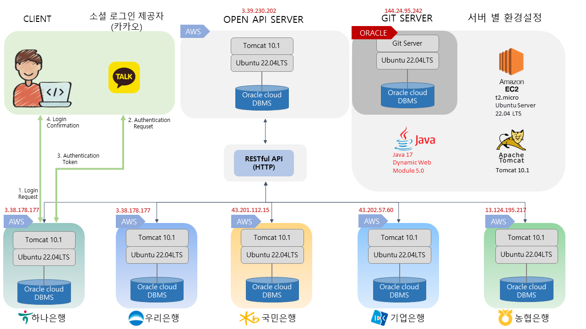
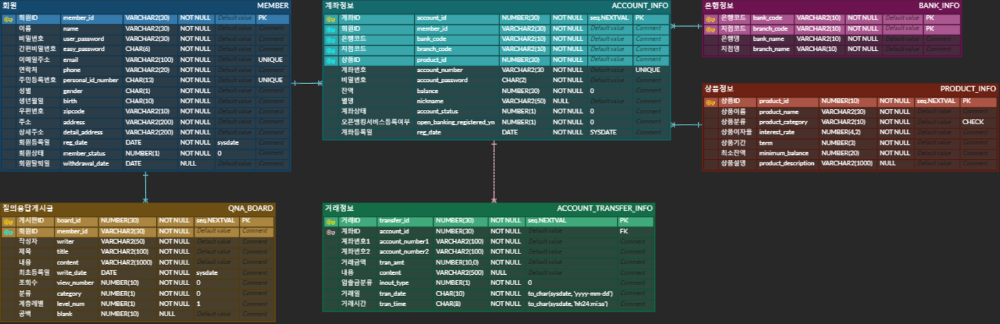
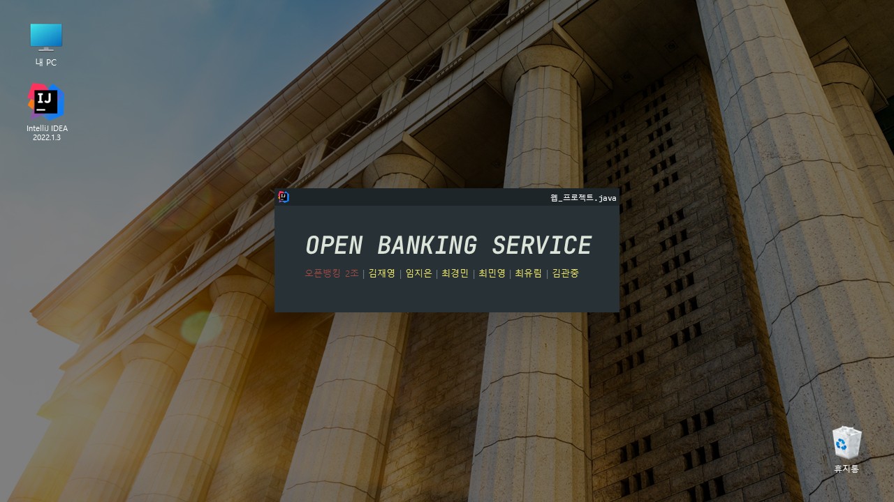
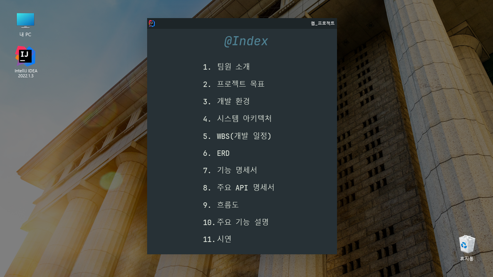
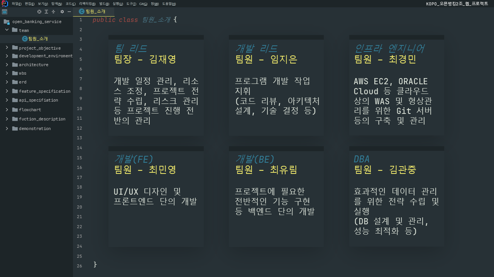
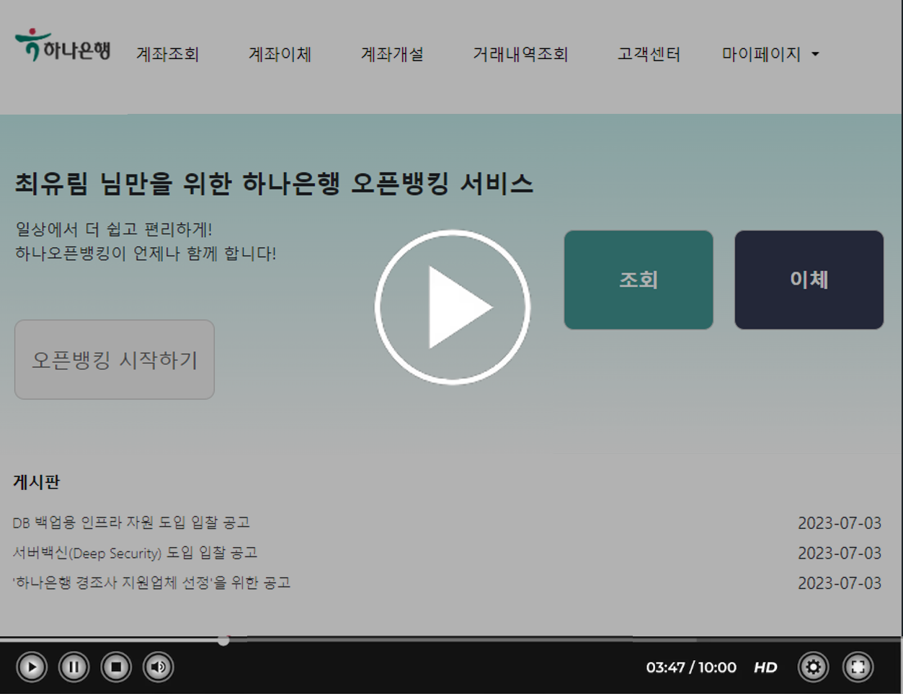
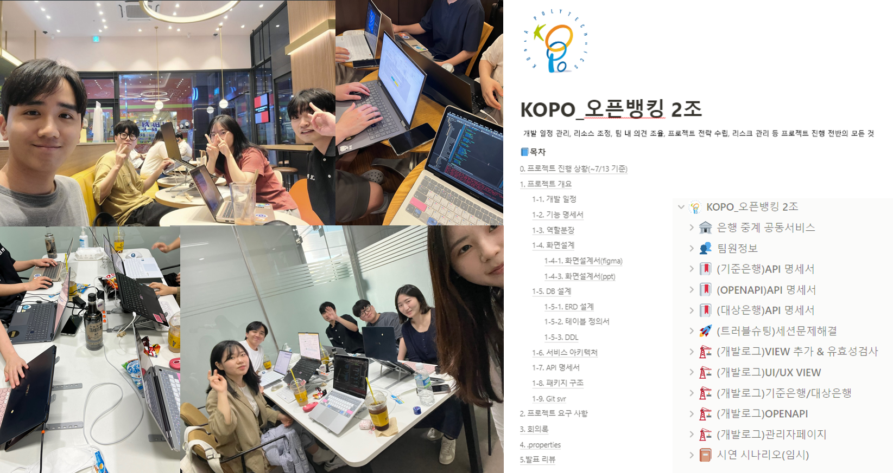

# 웹 개발 프로젝트 - 오픈뱅킹 시스템

본 프로젝트의 주 목표는 클라우드 기반의 OPEN API(RESTful API) 서버를 개발하여 다양항 은행들과 연동 가능한 오픈뱅킹 시스템을 구축하는 것입니다. 이를 통하여 사용자는 여러 은행 계정 정보를 보다 효율적으로 관리할 수 있게됩니다. 최종적으로 사용자가 안전하고 효율적으로 사용 가능한 오픈뱅킹 플랫폼을 개발하는 것이 본 프로젝트의 최종 목표입니다.

## 과목 개요

- MVC 기반 설계
- JSP와 Servlet을 이용한 동적 웹 프로젝트 구축
- RESTful API를 사용하여 클라우드 기반의 OPEN API 서버 구축

## 과제 목록

### 1. 소셜 로그인 적용

- OAuth 2.0 기술을 활용하여 카카오, 네이버 등의 소셜 로그인을 프로젝트 내 적용

### 2. 클라우드 기반의 OPEN API 서버 구축

- AWS, Oracle Cloud 등의 클라우드 서비스를 활용하여 RESTful API를 사용하는 OPEN API 서버를 구축

### 3. OPEN API 서버 기반의 오픈뱅킹 서비스 구현

- 구축한 OPEN API 서버를 기반으로 동작하 오픈뱅킹 서비스를 구현

## 시스템 아키텍처

 

## ERD

 

## 발표 PPT
 [1차_발표자료](/ppt1.pdf)
 [최종_발표자료](/ppt2.pdf)

 
 
 

## 시연

## 느낀 점

 

- 김재영 - 이번 팀 프로젝트를 통하여 소통과 문서화의 중요성에 대해서 다시 한 번 느낄 수 있었습니다. 프로젝트 초기 체계적으로 서비스를 설계하지 못한다면 프로젝트를 진행하며 어려움들이 계속해서 발생할 수 있다는 것을 몸소 체험하였습니다.
- 최경민 - 이번 프로젝트를 하면서 개발을 함에 있어서 계획적이고 체계적으로 설계하고 개발해야된다는 점을 깨닫게 되었습니다. 또한 이번 기회를 통해 저의 부족한 개념을 알게 되었고 최종프로젝트에 많은 도움이 될 것 같아 좋았습니다.
- 최유림 - 개발을 진행하면서 체계적인 명세서와 서류 작업 등 역시 중요하다는 것을 배웠고 팀원들에게 다양한 측면에서 배울 수 있었습니다. 프로젝트가 처음부터 끝까지 어떻게 진행되는지 경험할 수 있었던 것이 좋았습니다.
- 최민영 - 프로젝트를 진행하면서 협업의 중요성을 더 느꼈고 프론트엔드와 백엔드 간의 상호작용과 데이터베이스 관리 등에 대한 지식을 더 넓게 확장할 수 있었습니다. 또한 문제를 해결하기 위해 사용자 입장이 되어보면서 지속적으로 테스트하고 수정하는 과정에서 웹사이트의 사용자 친화성을 고려한 개발에 대해 한번 더 생각해 볼 수 있었습니다.
- 김관중 - 프로젝트를 통해 다양한 기술을 습득하고 프로젝트를 어떤 식으로 진행해야 하는지를 알게 되어 좋은 경험이었습니다. 기술 외적으로도 산출물과 같은 서류 작업의 중요성을 알게 되었고 향후 개인 프로젝트를 수행하는 데 있어 큰 도움이 되는 경험이었습니다.
